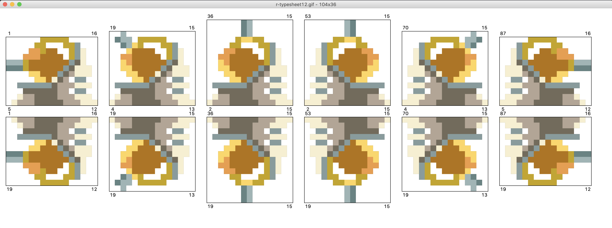
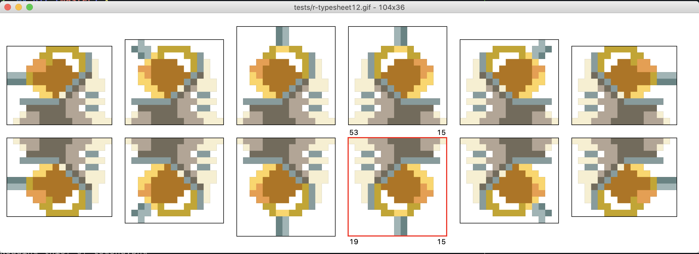
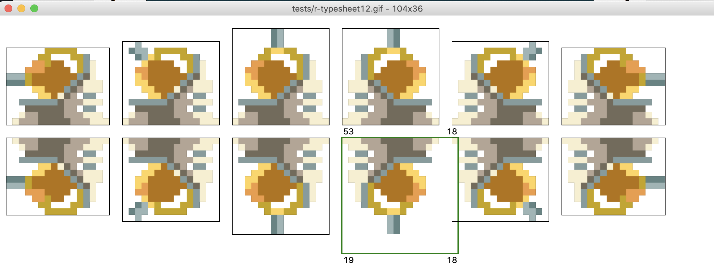

# Rect Generator

---

A python gui that auto create sprites rectangles on spritesheets.

---

### Installation

```
$ git clone git@github.com:Yohannfra/sprite-rect-generator.git
$ sudo ./install.sh
```

> The executable is installed in ~/.local/bin/

If you have troubles with missing **PIL** or **ImageTk** checkout [this link](https://stackoverflow.com/questions/44835909/cannot-import-name-imagetk-python-3-5).

or

```
pip3 install pillow --user
```

---

### Usage

```
rect_generator spritesheet
```

---

### Keys

| Key                              | Action                       |
| -------------------------------- | ---------------------------- |
| p                                | Zoom in                      |
| m                                | Zoom out                     |
| r                                | Reset view                   |
| t                                | Toggle rects positions texts |
| Left                             | Move view 40 px left         |
| Right                            | Move view 40 px right        |
| Up                               | Move view 40 px up           |
| Down                             | Move view 40 px down         |
| Mouse Left Click                 | Select a rectangle           |
| u (when a rectangle is selected) | Enable **resize mode**       |
| Escape                           | Quit                         |

#### When in Resize mode:

| Key                                         | Action                                         |
| ------------------------------------------- | ---------------------------------------------- |
| Shift-Right                                 | Remove one pixel on the left side              |
| Shift-Left                                  | Remove one pixel on the right side             |
| Shift-Up                                    | Remove one pixel on the bottom side            |
| Shift-Down                                  | Remove one pixel on the top side               |
| Left                                        | Add one pixel on the left side                 |
| Right                                       | Add one pixel on the right side                |
| Up                                          | Add one pixel on the top side                  |
| Down                                        | Add one pixel on the bottom side               |
| Mouse Left Click (on a different rectangle) | Select the rectangle and switch to normal mode |
| u                                           | Disable **resize mode**                        |

---

### Supported formats

- **.png**
- **.gif**
- **jpg**

I haven't tested any other format yet but feel free to open an issue if you think an important format is missing.

---

### Screenshots

> I do not own this spritesheet and it's only here for demonstrations purposes.

**With enabled texts:**



**When a rect is selected:**



**Resize mode enabled:**



---

## Licence
    This project is licensed under the terms of the MIT license.
